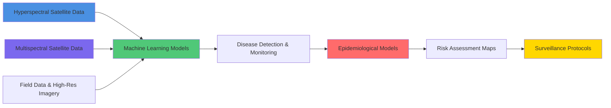

<div align="center">

<!-- Banner personalizado con gradiente -->


<!-- Badges de redes sociales con estilo personalizado -->
<p>
  <a href="https://www.linkedin.com/in/rocio-calderon-phd-remotesensing/">
    
  </a>
  <a href="https://orcid.org/0000-0002-7639-1795">
    
  </a>
  <a href="https://scholar.google.es/citations?user=frtN8xwAAAAJ&hl=es&oi=ao">
    
  </a>
  <a href="https://rcalderonmadrid.wixstudio.com/portafolio-inicio">
    
  </a>
</p>

<!-- Typing SVG animado -->


</div>

<br>

<!-- Sección About Me con diseño mejorado -->
<details open>
<summary><h2>🔬 About Me</h2></summary>
<br>

```yaml
Position: Postdoctoral Research Associate
Program: MOMENTUM Programme
Institution: Instituto de Agricultura Sostenible (IAS-CSIC)
Location: Córdoba, Spain
Background: Agricultural & Civil Engineering | PhD Universidad de Córdoba
```


With a background in **Agricultural and Civil Engineering** and a **PhD from the University of Córdoba**, my research career spans institutions across 🇪🇸 **Spain**, 🇬🇧 **United Kingdom**, and 🇺🇸 **United States**.

### 🎯 Research Expertise

I specialize in the **early detection and risk assessment** of plant pathogens including:
- 🦠 *Verticillium dahliae*
- 🦠 *Xylella fastidiosa*  
- 🦠 *Fusarium oxysporum*

Integrating **remote sensing** and **epidemiological modeling** for comprehensive plant disease surveillance.

### 🌱 Current Mission

Developing **operational surveillance systems** for emerging plant diseases in the context of climate change, using a digital ecosystem that combines:

<table>
<tr>
<td width="33%" align="center">

<br><b>Satellite Remote Sensing</b>
</td>
<td width="33%" align="center">

<br><b>Computational Models</b>
</td>
<td width="33%" align="center">

<br><b>Artificial Intelligence</b>
</td>
</tr>
</table>

This strategy **optimizes resources**, **reduces economic and environmental impacts**, ensures **food security**, and enhances **agricultural ecosystem resilience** against climate change and virulent pathogens.

</details>

<br>

<!-- Sección de proyecto actual con diseño mejorado -->
<details open>
<summary><h2>🚀 Current Research Project</h2></summary>
<br>

<div align="center">


</div>

<br>

> **Integration of Remote Sensing and Epidemiological Models for Operational Surveillance and Risk Assessment of Emerging Plant Diseases in a Climate Change Context**

### 📍 Context

The spread of emerging plant diseases, exacerbated by **climate change** and **globalization**, threatens global food security and biodiversity. This project addresses *Xylella fastidiosa* (**Xf**), considered the **first priority pest in the EU**.

### 🎯 Research Objectives

<table>
<tr>
<td width="33%" valign="top">

**🛰️ Objective 1**

Evaluate **hyperspectral** and **multispectral** satellite imagery for detection and monitoring of *Xf* diseases at regional scale

<br>

**Key Activities:**
- Analyze spectral traits using Radiative Transfer Models (RTM)
- Develop generalizable ML algorithms
- Detect early, intermediate, and severe symptom levels

</td>
<td width="33%" valign="top">

**🧬 Objective 2**

Integrate satellite imagery into **epidemiological models** to optimize surveillance and control strategies

<br>

**Key Activities:**
- Quantitatively evaluate epidemiological parameters
- Implement Bayesian inference
- Optimize surveillance programs

</td>
<td width="33%" valign="top">

**🌍 Objective 3**

Enhance **risk assessment** in climate change context integrating multiple data sources

<br>

**Key Activities:**
- Identify biotic/abiotic establishment factors
- Explore climate change implications
- Generate proactive surveillance protocols

</td>
</tr>
</table>

### 🔬 Methodological Innovation



</details>

<br>

<!-- Tech Stack mejorado -->
<details open>
<summary><h2>🛠️ Tech Stack & Skills</h2></summary>
<br>

<div align="center">

### Programming Languages


### Remote Sensing & GIS


### Data Science & ML


### Specialized Tools


</div>

<br>

<div align="center">

### 🎯 Core Competencies

<table>
<tr>
<td align="center" width="25%">
<br>
<b>Remote Sensing</b><br>
<sub>Hyperspectral & Multispectral Analysis</sub>
</td>
<td align="center" width="25%">
<br>
<b>Spatial Analysis</b><br>
<sub>GIS & Earth Observation</sub>
</td>
<td align="center" width="25%">
<br>
<b>Epidemiology</b><br>
<sub>Plant Pathology Modeling</sub>
</td>
<td align="center" width="25%">
<br>
<b>Machine Learning</b><br>
<sub>AI for Disease Detection</sub>
</td>
</tr>
<tr>
<td align="center" width="25%">
<br>
<b>Statistical Modeling</b><br>
<sub>Bayesian Inference</sub>
</td>
<td align="center" width="25%">
<br>
<b>Climate Science</b><br>
<sub>Impact Assessment</sub>
</td>
<td align="center" width="25%">
<br>
<b>Big Data</b><br>
<sub>Analysis & Integration</sub>
</td>
<td align="center" width="25%">
<br>
<b>Computational Biology</b><br>
<sub>Digital Phytopathology</sub>
</td>
</tr>
</table>

</div>

</details>

<br>

<!-- Publicaciones con estilo mejorado -->
<details>
<summary><h2>📚 Featured Publications</h2></summary>
<br>

<div align="center">

> 📝 **Coming Soon**
> 
> Key publications with DOI links will be added here
> 
> *Format:*
> ```
> 📄 Title of Paper
> 📖 Journal Name, Year
> 🔗 DOI: 10.xxxx/xxxxx
> ```

</div>

</details>

<br>

<!-- GitHub Stats mejorados -->
<details open>
<summary><h2>📊 GitHub Analytics</h2></summary>
<br>

<div align="center">


</div>

</details>

<br>

<!-- Sección de impacto con diseño mejorado -->
<details open>
<summary><h2>🌐 Research Impact</h2></summary>
<br>

<div align="center">

```ascii
╔══════════════════════════════════════════════════════════════════════╗
║                    CONTRIBUTIONS TO GLOBAL CHALLENGES                ║
╚══════════════════════════════════════════════════════════════════════╝
```

</div>

<table>
<tr>
<td width="50%" valign="top">

### 🌾 Food Security
- Early disease detection systems
- Reduced crop losses
- Enhanced agricultural productivity

### 🌍 Climate Resilience  
- Adaptive surveillance strategies
- Climate-smart agriculture
- Ecosystem resilience enhancement

</td>
<td width="50%" valign="top">

### 💚 Sustainable Agriculture
- Optimized resource utilization
- Reduced pesticide application
- Environmental impact mitigation

### 📡 Technology Advancement
- Operational remote sensing applications
- Phytosanitary policy support
- Digital phytopathology innovation

</td>
</tr>
</table>

<div align="center">

### 🎯 UN Sustainable Development Goals


</div>

</details>

<br>

<!-- Sección de contacto mejorada -->
<div align="center">

## 📫 Let's Connect!


**Interested in collaborations on:**
- 🌱 Plant Disease Surveillance
- 🛰️ Remote Sensing Applications  
- 📊 Epidemiological Modeling
- 🌍 Climate Change Impact Assessment

<br>


<br>


</div>
