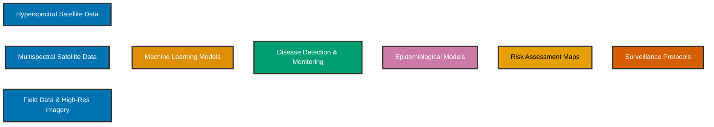

<div align="center">

<!-- Banner personalizado -->


<h1>Rocío Calderón Madrid, PhD</h1>
<h3>Plant Disease Surveillance | Remote Sensing | Epidemiological Modeling</h3>

<!-- Redes Profesionales con colores colorblind-friendly -->
<p>
  <a href="https://www.linkedin.com/in/rocio-calderon-phd-remotesensing/">
    
  </a>
  <a href="https://orcid.org/0000-0002-7639-1795">
    
  </a>
  <a href="https://scholar.google.es/citations?user=frtN8xwAAAAJ&hl=es&oi=ao">
    
  </a>
  <a href="https://rcalderonmadrid.wixstudio.com/portafolio-inicio">
    
  </a>
</p>

<!-- Redes Sociales -->
<p>
  <a href="https://x.com/rcalderonmadrid">
    
  </a>
  <a href="https://www.instagram.com/rcalderonm85/">
    
  </a>
  <a href="https://bsky.app/profile/rcalderonmadrid.bsky.social">
    
  </a>
</p>

</div>

<br>

<!-- Sección About Me con diseño mejorado -->
<details open>
<summary><h2>🔬 About Me</h2></summary>
<br>

<div align="center">

<!-- Información de posición -->
<p>
  <br>
  <a href="https://momentum.csic.es" target="_blank">
    
  </a><br>
  <a href="https://www.ias.csic.es/?lang=en" target="_blank">
    
  </a><br>
  
</p>

</div>

```yaml
Position: Postdoctoral Research Associate
Program: MOMENTUM Programme
Institution: Institute for Sustainable Agriculture (IAS-CSIC)
Location: Córdoba, Spain
Background: Agricultural & Civil Engineering | PhD University of Córdoba
```


With a background in **Agricultural and Civil Engineering** and a **PhD from the University of Córdoba**, my research career spans institutions across 🇪🇸 **Spain**, 🇬🇧 **United Kingdom**, and 🇺🇸 **United States**.

### 🎯 Research Expertise

I specialize in the **early detection and risk assessment** of plant pathogens including:
- 🍄 *Verticillium dahliae*
- 🦠 *Xylella fastidiosa*  
- 🍄 *Fusarium oxysporum*

Integrating **remote sensing** and **epidemiological modeling** for comprehensive plant disease surveillance and management.

### 🌱 Current Mission

Developing **operational surveillance systems** for emerging plant diseases in the context of climate change, using a digital ecosystem that combines:

<div align="center">

<table>
<tr>
<td width="33%" align="center">

<br><b>Satellite Remote Sensing</b>
</td>
<td width="33%" align="center">

<br><b>Computational Models</b>
</td>
<td width="33%" align="center">

<br><b>Artificial Intelligence</b>
</td>
</tr>
</table>

</div>

This strategy **optimizes resources**, **reduces economic and environmental impacts**, ensures **food security**, and enhances **agricultural ecosystem resilience** against climate change and virulent pathogens.

</details>

<br>

<!-- Sección de proyecto actual con diseño mejorado -->
<details open>
<summary><h2>🚀 Current Research Project</h2></summary>
<br>

<div align="center">


</div>

<br>

<div align="center">

### **Integration of Remote Sensing and Epidemiological Models for Operational Surveillance and Risk Assessment of Emerging Plant Diseases in a Climate Change Context**

</div>

<br>

### 📍 Context

The spread of emerging plant diseases, exacerbated by **climate change** and **globalization**, threatens global food security and biodiversity. This project addresses *Xylella fastidiosa* (*Xf*), considered the **first priority pest in the EU**.

### 🎯 Research Objectives

<table>
<tr>
<td width="33%" valign="top">

**🛰️ Objective 1**

Evaluate **hyperspectral** and **multispectral** satellite imagery for detection and monitoring of *Xf* diseases at regional scale

<br>

**Key Activities:**
- Analyze spectral traits using Radiative Transfer Models (RTM)
- Develop generalizable ML algorithms
- Detect early, intermediate, and severe symptom levels

</td>
<td width="33%" valign="top">

**🧬 Objective 2**

Integrate satellite imagery into **epidemiological models** to optimize surveillance and control strategies

<br>

**Key Activities:**
- Quantitatively evaluate epidemiological parameters
- Optimize surveillance and control programs

</td>
<td width="33%" valign="top">

**🌍 Objective 3**

Enhance **risk assessment** in climate change context integrating remote sensing, species distribution models and spread models

<br>

**Key Activities:**
- Identify biotic/abiotic establishment factors
- Explore climate change implications
- Generate proactive surveillance protocols

</td>
</tr>
</table>

### 🔬 Methodological Innovation



</details>

<br>

<!-- Tech Stack mejorado -->
<details open>
<summary><h2>🛠️ Tech Stack & Skills</h2></summary>
<br>

<div align="center">

### Programming Languages


### Remote Sensing & GIS


### Data Science & ML


### Data Analysis & Visualization


### Specialized Tools


</div>

<br>

<div align="center">

### 🎯 Core Competencies

<table>
<tr>
<td align="center" width="25%">
<br>
<b>Remote Sensing</b><br>
<sub>Hyperspectral & Multispectral Analysis</sub>
</td>
<td align="center" width="25%">
<br>
<b>Spatial Analysis</b><br>
<sub>GIS & Earth Observation</sub>
</td>
<td align="center" width="25%">
<br>
<b>Epidemiology</b><br>
<sub>Epidemiological Modeling</sub>
</td>
<td align="center" width="25%">
<br>
<b>Machine Learning</b><br>
<sub>AI for Plant Disease Detection</sub>
</td>
</tr>
<tr>
<td align="center" width="25%">
<br>
<b>Statistical Modeling</b><br>
<sub>Bayesian Inference</sub>
</td>
<td align="center" width="25%">
<br>
<b>Climate Science</b><br>
<sub>Earth System Modeling & Impact Assessment</sub>
</td>
<td align="center" width="25%">
<br>
<b>Big Data</b><br>
<sub>Analysis & Integration</sub>
</td>
<td align="center" width="25%">
<br>
<b>Computational Biology</b><br>
<sub>Digital Phytopathology</sub>
</td>
</tr>
</table>

</div>

</details>

<br>

<!-- Publicaciones con estilo mejorado -->
<details open>
<summary><h2>📚 Featured Publications</h2></summary>
<br>

1. **High-resolution airborne hyperspectral and thermal imagery for early detection of Verticillium wilt of olive using fluorescence, temperature and narrow-band spectral indices (2013)**  
   📖 *Remote Sensing of Environment* 139, 231-245  
   👥 R Calderón, JA Navas-Cortés, C Lucena, PJ Zarco-Tejada  
   🔗 [DOI: 10.1016/j.rse.2013.08.006](https://www.sciencedirect.com/science/article/abs/pii/S0034425713002435)

2. **Previsual symptoms of Xylella fastidiosa infection revealed in spectral plant-trait alterations (2018)**  
   📖 *Nature Plants* 4 (7), 432-439  
   👥 PJ Zarco-Tejada, C Camino, PSA Beck, R Calderon, A Hornero, et al.  
   🔗 [DOI: 10.1038/s41477-018-0189-7](https://www.nature.com/articles/s41477-018-0189-7)

3. **Divergent abiotic spectral pathways unravel pathogen stress signals across species (2021)**  
   📖 *Nature Communications* 12 (1), 6088  
   👥 PJ Zarco-Tejada, T Poblete, C Camino, V González-Dugo, R Calderon, et al.  
   🔗 [DOI: 10.1038/s41467-021-26335-3](https://www.nature.com/articles/s41467-021-26335-3)

4. **Detection of Xylella fastidiosa in almond orchards by synergic use of an epidemic spread model and remotely sensed plant traits (2021)**  
   📖 *Remote Sensing of Environment* 260, 112420  
   👥 C Camino, R Calderón, S Parnell, H Dierkes, Y Chemin, M Román-Écija, et al.  
   🔗 [DOI: 10.1016/j.rse.2021.112420](https://www.sciencedirect.com/science/article/pii/S0034425721001383)

5. **Opportunities and challenges in combining optical sensing and epidemiological modelling (2025)**  
   📖 *Phytopathology*  
   👥 A Mikaberidze, CD Cruz, A Zerihun, A Barreto, P Beck, R Calderón, et al.  
   🔗 [DOI: 10.1094/PHYTO-11-24-0359-FI](https://apsjournals.apsnet.org/doi/full/10.1094/PHYTO-11-24-0359-FI)

<div align="center">

---

For a complete list of publications, visit my [Google Scholar Profile](https://scholar.google.es/citations?user=frtN8xwAAAAJ&hl=es&oi=ao)

</div>

</details>

<br>

<!-- GitHub Stats mejorados -->
<details open>
<summary><h2>📊 GitHub Analytics</h2></summary>
<br>

<div align="center">


</div>

</details>

<br>

<!-- Sección de impacto con diseño mejorado -->
<details open>
<summary><h2>🌐 Research Impact</h2></summary>
<br>

<div align="center">

```ascii
╔══════════════════════════════════════════════════════════════════════╗
║                    CONTRIBUTIONS TO GLOBAL CHALLENGES                ║
╚══════════════════════════════════════════════════════════════════════╝
```

</div>

<table>
<tr>
<td width="50%" valign="top">

### 🌾 Food Security
- Early disease detection systems
- Reduced crop losses
- Enhanced agricultural productivity

### 🌍 Climate Resilience  
- Adaptive surveillance strategies
- Climate-smart agriculture
- Ecosystem resilience enhancement

</td>
<td width="50%" valign="top">

### 💚 Sustainable Agriculture
- Optimized resource utilization
- Reduced pesticide application
- Environmental impact mitigation

### 📡 Technology Advancement
- Operational remote sensing applications
- Phytosanitary policy support
- Digital phytopathology innovation

</td>
</tr>
</table>

<div align="center">

### 🎯 UN Sustainable Development Goals


</div>

</details>

<br>

<!-- Sección de contacto mejorada -->
<div align="center">

## 📫 Let's Connect!

<table align="center">
<tr>
<td align="center" width="50%">

</td>
<td align="left" width="50%">

**Interested in collaborations on:**
- 🌱 Plant Disease Surveillance
- 🛰️ Remote Sensing Applications  
- 📊 Epidemiological Modeling
- 🌍 Climate Change Impact Assessment

</td>
</tr>
</table>

<div align="center">

### Connect with me on social media:

<a href="https://x.com/rcalderonmadrid">
  
</a>
<a href="https://www.instagram.com/rcalderonm85/">
  
</a>
<a href="https://bsky.app/profile/rcalderonmadrid.bsky.social">
  
</a>

<br><br>

---

<p>
<em>Integrating Technology and Science for a Sustainable Future</em>
</p>


</div>

</div>
